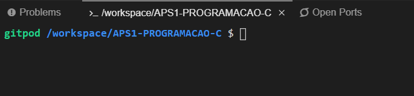
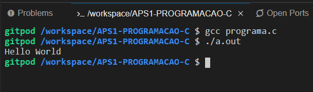

# APS1-PROGRAMACAO-C

# PASSO 1:
executar o gitpod clicando no botão:  

# PASSO 2:
Ao abrir o gitpod ele vai abri a IDE baseado no VSCODE:
Para executar o programa em C basta ir ao terminal:  

# PASSO 3:
Ira ter o arquivo chamado 'programa.c' que é o codigo e para compilar ele algo similar ao F9 no DEVC++:
Basta executar no terminal abaixo o comando:

* gcc programa.c

# PASSO 4:
Apois compilar ele ira gera um arquivo a.out para visualizar o codigo basta executa o arquivo a.out:

* ./a.out

# PASSO 5:
Resultado final:  

